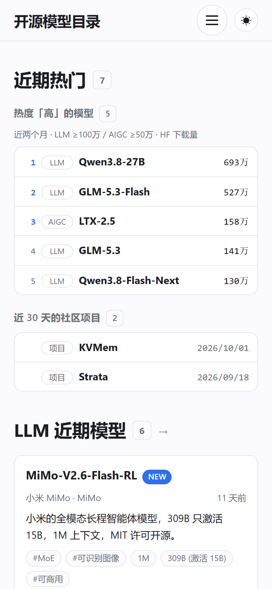

# 开源模型目录

网站链接：https://omdir.de5.net/ QQ交流群：1128481543

开源模型现在几乎每周都在冒新名字。等你想起来要找的时候，已经分不清哪些是这个月刚出的、
哪些真能下载权重、哪些又是拿别人权重做的换皮微调。

这个站把**新发布的开源模型**按时间收成一条线：**一条收录 = 官方链接 + 发布日 + 一句话简介**。
打开看一眼就知道"这段时间出了什么、能不能上手跑"，不用再翻热搜和一堆转述文章。




## 站里有什么

- **首页**：最上面是**近期热门** —— 近两个月里热度「高」的 LLM 与 AIGC 混在一条榜上，
  按 HuggingFace 近 30 天下载量从高到低排；下面还单列了近 30 天的社区项目。
  这块不是入口，点不了；再往下两块是 LLM 与 AIGC 最近 30 天的模型，
  大标题本身就是入口，点 LLM 进开源模型、点 AIGC 进生图
- **开源模型**：按 年-月 分组的时间线，同一月里新的在前。左侧三张下拉卡片可以叠加筛选 ——
  **时间**（按年分组选月份）、**所属**（Qwen / DeepSeek / GLM / FLUX…）、
  **筛选**（热度 / 结构 / 类型 / 上下文 / 参数量 / 商用），勾完就地生效，不刷新页面
- **热度**：按 HuggingFace 的近 30 天下载量分档，且 **LLM 与 AIGC 各一套阈值** ——
  LLM `低 <10万` / `中 10万-100万` / `高 ≥100万`，AIGC `低 <10万` / `中 10万-50万` / `高 ≥50万`
  （生图 / 生视频的下载量整体低一档）。想知道"大家真在跑哪个"，直接从这一组点进去
- **生图 / 生视频**：单独一块，同一套筛选与时间线；架构分 `DiT` / `MMDiT` / `自回归` / `离散扩散`
- **条目详情**：完整外链（HuggingFace / GitHub / 论文 / 在线体验）、参数表（参数量、上下文、
  推荐显存、所属、许可、商用、发布与收录时间），以及这个模型能用的部署方式
- **社区项目 / 部署方式**：社区围绕开源模型做的方案，以及推理 / 量化 / 微调 / 服务化工具
- 另外还有顶部搜索（认型号名，也认发布方与家族）、卡片右侧的"3 天前"与最近 14 天的 **NEW** 角标、
  深色 / 浅色开关（默认跟随系统）、RSS 与 sitemap

## 收什么、不收什么

**收**：机构自研、权重真能下载的开放权重模型，以 4B 起的大尺寸与主流版本为主，
各家族的官方版本（Instruct / Thinking / Coder / VL）各算一条。
AIGC 松一档：机构第一方自己训练、自己放权重就收，哪怕是在开源权重上继续训练。

**不收**：只有 API 的闭源服务、个人微调与换皮小模型、空仓库，
拿别人权重做的微调 / 蒸馏 / 剪枝再发布，以及新闻资讯和评测长文。

## 现在收了多少

| 板块 | 条数 | 覆盖 |
| --- | --- | --- |
| LLM 开源模型 | **257** | 2025-01 ～ 2026-09、44 个家族（Qwen 44 / DeepSeek 19 / GLM 17 / Ling 16 / Mistral 15…） |
| AIGC 生图 · 生视频 | **142**（生图 64 / 生视频 78） | 21 个月、65 个家族（Wan 12 / Hunyuan 8 / Qwen-Image 7 / FLUX 6…）、48 个发布方 |
| 社区项目 | 21 | 社区围绕开源模型做的方案 |
| 部署方式 | 17 | vLLM / SGLang / llama.cpp / Ollama |

## 怎么做的

**Astro + Markdown 内容集合 + Zod 校验**，纯静态：没有数据库、没有后端、没有登录。
一个条目一个 `.md` 文件，Git 就是后台，看得见 diff；字段写错、简介太短、链接写错，
构建直接失败，坏数据上不了线。想加一条：`pnpm new llm "型号名"`，或者直接写一个 `.md`。

热度用的是 HuggingFace 下载量的一份快照，随仓库一起走，所以**构建不需要联网**。

```bash
pnpm install
pnpm dev        # http://localhost:4321
pnpm build      # 产出 dist/，纯静态，丢哪都能托管
```

## 许可

站点代码随意使用；收录内容的链接、模型与代码版权归各自原作者所有。