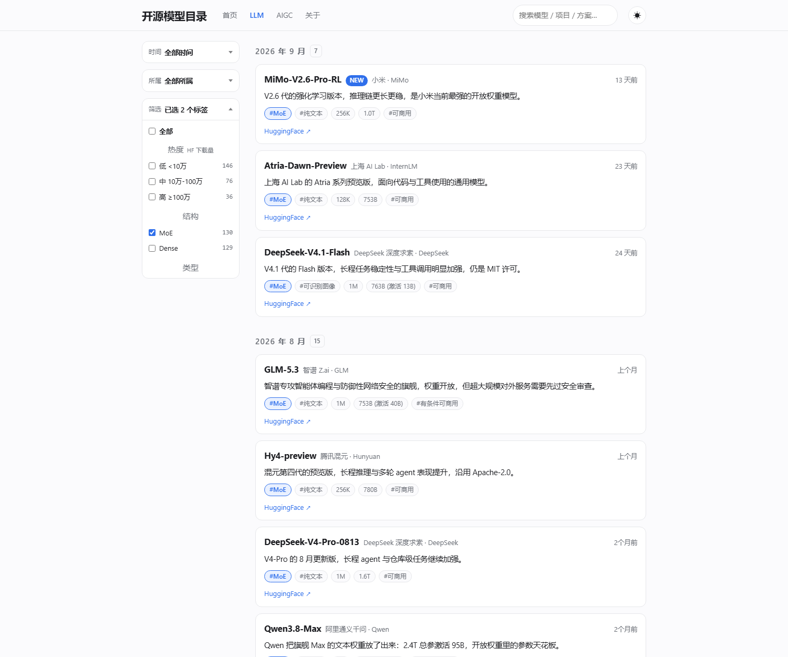
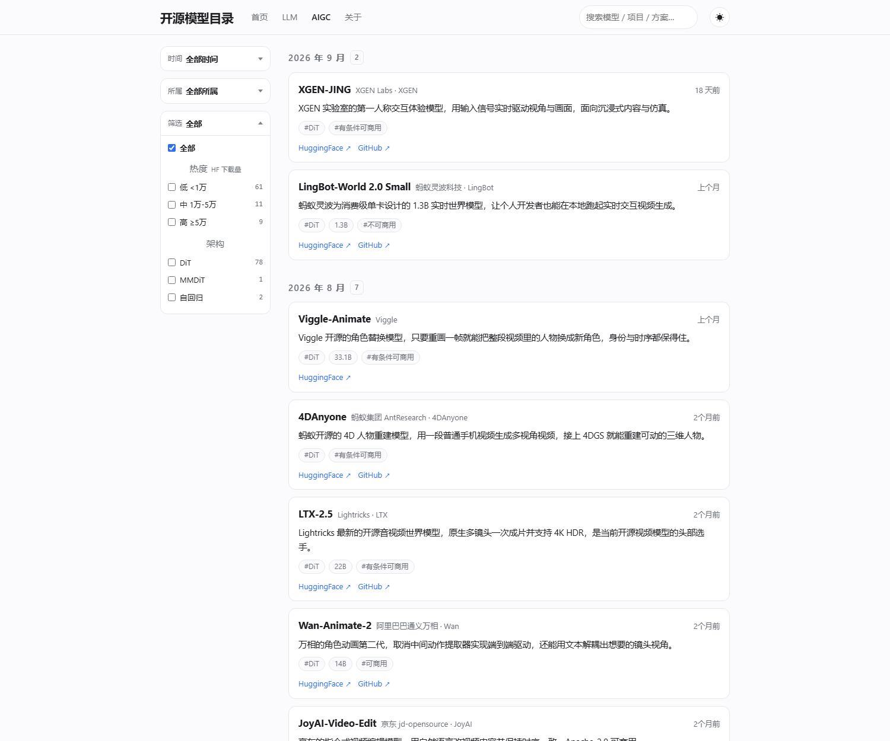

# 开源模型目录

线上：<https://omdir.de5.net/> ｜ QQ 交流群：1128481543

## 项目简介

开源模型现在几乎每周都在冒新名字。等你想起来要找的时候，已经分不清哪些是这个月刚出的、
哪些真能下载权重、哪些又是拿别人权重做的换皮微调。

这个站把**新发布的开源模型**按时间收成一条线：**一条收录 = 官方链接 + 发布日 + 一句话简介**。
打开看一眼就知道"这段时间出了什么、能不能上手跑"，不用再翻热搜和一堆转述文章。

- **首页**：最上面是**近期热门** —— 近两个月里热度「高」的 LLM 与 AIGC 混在一条榜上，按 HuggingFace
  近 30 天下载量从高到低排，下面还单列了近 30 天的社区项目；再往下两块是 LLM 与 AIGC 最近 30 天的模型，
  大标题本身就是入口
- **开源模型 / 生图 / 生视频**：按 年-月 分组的时间线，同一月里新的在前。左侧三张下拉卡片可以叠加筛选 ——
  **时间**（按年分组选月份）、**所属**（Qwen / DeepSeek / GLM / FLUX…）、
  **筛选**（热度 / 结构 / 类型 / 上下文 / 参数量 / 商用），每张都是多选，勾完就地生效、不刷新页面
- **热度**：按 HuggingFace 近 30 天下载量分档，且 **LLM 与 AIGC 各一套阈值** ——
  LLM `低 <10万` / `中 10万-100万` / `高 ≥100万`，AIGC `低 <1万` / `中 1万-5万` / `高 ≥5万`
  （生图 / 生视频的下载量整体低一到两个量级）
- **详情页**：完整外链（HuggingFace / GitHub / 论文 / 在线体验）、参数表（参数量、上下文、推荐显存、
  所属、许可、能否商用、发布与收录时间），以及这个模型能用的部署方式
- 另外还有顶部搜索（认型号名，也认发布方与家族）、卡片右侧的"3 天前"与最近 14 天的 **NEW** 角标、
  深色 / 浅色开关（默认跟随系统）、RSS 与 sitemap

**收**：机构自研、权重真能下载的开放权重模型，以 4B 起的大尺寸与主流版本为主，
各家族的官方版本（Instruct / Thinking / Coder / VL）各算一条。
AIGC 松一档：机构第一方自己训练、自己放权重就收，哪怕是在开源权重上继续训练。

**不收**：只有 API 的闭源服务、个人微调与换皮小模型、空仓库，
拿别人权重做的微调 / 蒸馏 / 剪枝再发布，以及新闻资讯和评测长文。

现在收了多少：

| 板块 | 条数 | 覆盖 |
| --- | --- | --- |
| LLM 开源模型 | **259** | 2025-01 ～ 2026-09 共 21 个月、43 个家族（Qwen 45 / DeepSeek 19 / GLM 17 / Ling 16 / Mistral 15…） |
| AIGC 生图 · 生视频 | **151**（生图 70 / 生视频 81） | 21 个月、66 个家族（Wan 13 / Hunyuan 10 / LongCat 7 / Qwen-Image 7 / FLUX 6…）、49 个发布方 |
| 社区项目 | 38 | 2025-01 ～ 2026-10，社区围绕开源模型做的方案 |
| 部署方式 | 17 | vLLM / SGLang / llama.cpp / Ollama…，按方案大类分组 |

## 安装

Node 22 + pnpm 11（`.nvmrc` 与 `packageManager` 里都写着）。

```bash
pnpm install
pnpm dev        # http://localhost:4321
pnpm build      # 产出 dist/，纯静态，丢哪都能托管
```

| 命令 | 作用 |
| --- | --- |
| `pnpm new <集合> "<名称>"` | 交互式新增一条收录（集合：`llm` / `aigc` / `projects` / `deploy`） |
| `pnpm check:links` | 检查外链是否失效（`--only llm` / `--only aigc` 只查一个集合） |
| `node _verify/hf-downloads.mjs` | 刷新热度快照（可选、要联网；**构建本身不联网**） |

不想用命令行就直接写一个 `.md`：一个条目一个文件，字段写错、简介太短、链接写错，
构建直接失败，坏数据上不了线。

部署：`dist/` 是纯静态产物，任何静态主机都能跑。本仓库走 **Cloudflare Worker + 静态资源**
（配置在 `wrangler.jsonc`）：Build command `pnpm run build`、Deploy command `npx wrangler deploy`；
上线后在 Worker → Settings → Build → Variables 里把 `SITE_URL` 设成正式域名，
canonical / sitemap / RSS 都取自它。

## 展示

截图都在 `assets/screenshots/`，浅色主题。

### 首页：近期热门 + 最近 30 天

<table>
  <tr>
    <td><a href="assets/screenshots/home-desktop-1440.png"></a></td>
    <td><a href="assets/screenshots/home-mobile-390.png"></a></td>
  </tr>
</table>

窄屏（≤860px）头部收成一行「品牌 + 汉堡 + 深色开关」，导航与搜索框进抽屉。

### 开源模型列表页：三张下拉卡片，多选叠加

<a href="assets/screenshots/listing-llm-filter-1500.png"></a>

图上勾了 `结构 = MoE` 和 `参数量 = 高 ≥500B`：**同组内是"或"、不同组之间是"与"**，
再与时间、所属做"与"。选择写在 URL hash 里（`#tag=MoE,高 ≥500B`），过滤就地发生、页面不刷新；
关掉 JS 只是不过滤，条目仍然全都能看到。

### 生视频列表页：热度与参数量各一套阈值

<a href="assets/screenshots/listing-aigc-video-1500.png"></a>

生图 / 生视频的下载量与参数量都比 LLM 小一到两个量级，所以这里热度是
`<1万 / 1万-5万 / ≥5万`、参数量是 `0-8B / 8-32B / ≥32B`，架构换成 `DiT / MMDiT / 自回归 / 离散扩散`。

### 详情页

模型详情页就三块：完整外链、参数表（含"能否商用"）、可用的部署方式；
社区项目与部署方式页多一段正文（它解决什么 / 什么时候用它 / 上手难点）。

## 程序

**Astro 7（纯静态输出）+ Markdown 内容集合 + Zod 校验**：没有数据库、没有后端、没有登录。

```
Markdown 文件 → src/content.config.ts 的 schema 校验 → 构建期生成静态页 → dist/
```

```
src/
  content.config.ts        四个集合的字段定义与校验，整站唯一的"数据合同"
  content/                 收录条目，一个条目一个 .md：llm/ aigc/ projects/ deploy/
  data/hf-downloads.json   热度快照（HF 近 30 天下载量）：构建期只读它，所以构建不联网
  lib/                     entries.ts 归一化与派生标签；taxonomy.ts 标签枚举与分档；
                           format.ts 文案映射；site.ts 站名与描述
  components/              EntryCard / EntryList / EntryTimeline / EntryDetail，
                           以及 TagFilter（左侧三张下拉卡片 + 就地过滤脚本）
  pages/                   首页、四个列表页、详情页、search.json、rss.xml、robots.txt、404
  layouts/BaseLayout.astro 外壳：顶部导航（宽屏悬停下拉 / 窄屏汉堡抽屉）、搜索框、深色开关
  styles/global.css        全部样式：一套 CSS 变量驱动浅色 / 深色，没用 CSS 框架
scripts/                   new-entry.mjs（加条目）、check-links.mjs（死链检查）
public/                    favicon.svg、_headers（Cloudflare 响应头）
docs/                      口径与开发文档
_verify/                   批量补录与核对脚本（可选，不参与构建）
```

口径与细节都在 `docs/`，改之前先看：

- [docs/项目结构/项目说明.md](docs/项目结构/项目说明.md) —— 收录标准、页面组织、字段口径（唯一口径）
- [docs/项目结构/开发与维护.md](docs/项目结构/开发与维护.md) —— 代码怎么分、命令、部署与环境坑
- [docs/项目技能/添加LLM模型.md](docs/项目技能/添加LLM模型.md) ·
  [添加AIGC模型.md](docs/项目技能/添加AIGC模型.md) —— 加条目的完整步骤

## 许可

站点代码随意使用；收录内容的链接、模型与代码版权归各自原作者所有。
